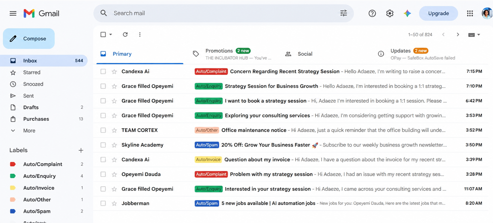
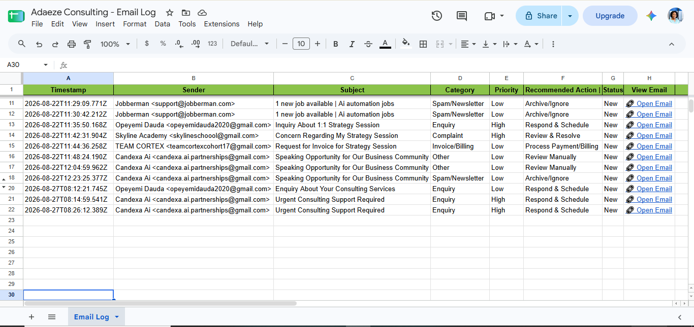
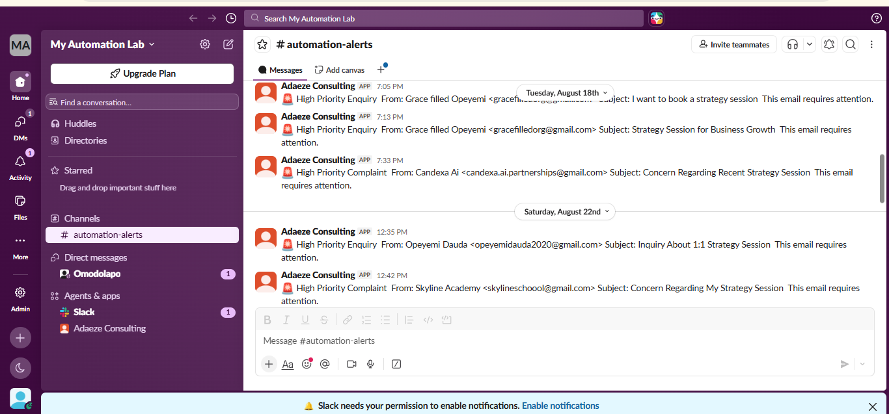
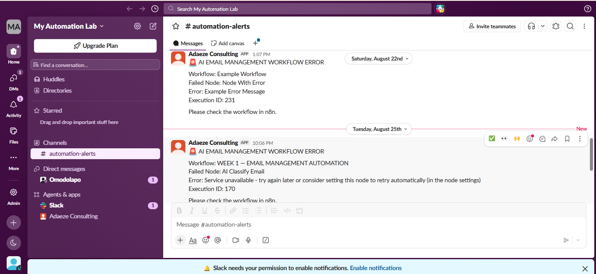

# Week 1: Email Management Automation

## Project Overview

I built an AI-powered email management and triage workflow for Adaeze Consulting, a solo SME growth strategist who provides paid 1:1 strategy sessions.

The workflow handles the initial review of incoming emails by using AI to classify each message, determine its priority, recommend a next action, organize it in Gmail, record it in Google Sheets, and notify Adaeze in Slack when an email requires prompt attention.

The goal was to reduce the amount of manual sorting required while keeping important emails visible and easy to act on.

## Business Problem

Adaeze Consulting receives different types of emails, including potential client enquiries, complaints, billing messages, newsletters, promotional emails, and other communications.

Without an organized triage process, manually reviewing each message can become time consuming and important emails may be mixed in with messages that do not require immediate attention.

I designed this workflow to handle the first level of email triage automatically and give the business owner a clearer view of what needs attention.

## How the Workflow Works

The workflow starts when a new email enters the Gmail inbox.

The email information is extracted and sent to Google Gemini for classification. The AI returns a category, priority, and recommended action.

The workflow then uses those results to organize and route the email.

```text
New Email
    ↓
Gmail Trigger
    ↓
Extract Email Data
    ↓
AI Email Classification
    ↓
Set Category, Priority and Recommended Action
    ↓
Prepare Email Record
    ↓
Map Gmail Label
    ↓
Retrieve Gmail Labels
    ↓
Apply Gmail Label
    ↓
Log Email in Google Sheets
    ↓
Check Priority
    ↓
Slack Alert for High Priority Emails
```

## AI Email Classification

I used Google Gemini to classify incoming emails into five categories.

| Category            | Description                                                                                                               |
| ------------------- | ------------------------------------------------------------------------------------------------------------------------- |
| **Enquiry**         | Potential or existing clients asking about services, pricing, availability, booking, consultation, or working with Adaeze |
| **Complaint**       | Customer dissatisfaction, service problems, refund requests caused by a problem, or formal complaints                     |
| **Invoice/Billing** | Invoices, receipts, payments, charges, or other billing related messages                                                  |
| **Spam/Newsletter** | Newsletters, promotional emails, unsolicited marketing, cold pitches, sales messages, or subscription emails              |
| **Other**           | Emails that do not clearly fit the other categories                                                                       |

The AI also assigns a priority:

* **High:** Requires prompt human attention
* **Low:** Does not require immediate attention

The classification output gives the rest of the workflow the information it needs to decide how the email should be organized and routed.

## Recommended Actions

The AI also recommends a next action based on the content of the email.

The available actions are:

* **Respond & Schedule**
* **Respond to Client**
* **Review & Resolve**
* **Process Payment/Billing**
* **Archive/Ignore**
* **Review Manually**

This gives the email more context than a category alone and helps the business owner understand what should happen next.

## Gmail Organization

After the email is classified, the workflow maps the AI category to a corresponding Gmail label.

```text
Enquiry          → Auto/Enquiry
Complaint        → Auto/Complaint
Invoice/Billing  → Auto/Invoice
Spam/Newsletter  → Auto/Spam
Other            → Auto/Other
```

The workflow retrieves the available Gmail labels before applying the appropriate label to the email.

This keeps processed emails organized without requiring the user to manually categorize every message.



## Google Sheets Email Log

Every processed email is recorded in a Google Sheets tracker.

The tracker contains:

* **Timestamp**
* **Sender**
* **Subject**
* **Category**
* **Priority**
* **Recommended Action**
* **Status**
* **View Email**

The **View Email** field contains a direct link to the original Gmail message. This makes it possible to move from the tracking sheet directly back to the email when further review is needed.




## Slack Alerts

I added priority based routing so that not every processed email generates a Slack notification.

When an email is classified as **High priority**, the workflow sends an alert to Slack with details such as:

* **Priority**
* **Category**
* **Sender**
* **Subject**

Low priority emails are not sent to Slack. They are still processed, labelled in Gmail, and recorded in Google Sheets.

This keeps Slack notifications focused on emails that are more likely to require immediate attention.



## Error Handling

I also created a separate error handling workflow for the main automation.

When an execution error occurs, the error workflow is triggered and sends a Slack notification.

```text
Main Workflow Error
        ↓
Error Trigger
        ↓
Slack Alert
        ↓
Error Information
```

The notification provides information about the failed workflow and node, making it easier to identify where the issue occurred and investigate it.



## Tools Used

| Tool              | Purpose                                                           |
| ----------------- | ----------------------------------------------------------------- |
| **n8n**           | Workflow automation and orchestration                             |
| **Gmail**         | Email trigger and automated email organization                    |
| **Google Gemini** | Email classification, priority detection, and recommended actions |
| **Google Sheets** | Email tracking and record keeping                                 |
| **Slack**         | High priority notifications and error alerts                      |

## Key Features

* Automated email intake
* AI powered email classification
* Priority detection
* Recommended action generation
* Automated Gmail labeling
* Google Sheets email tracking
* Direct links to original Gmail messages
* Priority based Slack notifications
* Separate error handling workflow

## Project Screenshots

### Complete Workflow


### AI Classification Node


### Gmail Auto Label


### Google Sheets Email Log


### Google Sheets Output


### Slack Email Alert


### Error Handling and Slack Alert


## Project File

The repository includes a sanitized n8n workflow export:

`WEEK 1 — EMAIL MANAGEMENT AUTOMATION - GITHUB SAFE.json`

Credentials and private account configuration have been removed from the public workflow export.

## Project Type

**AI Automation | Email Management | Workflow Automation | Business Process Automation**

Built as part of my practical AI Automation portfolio.
