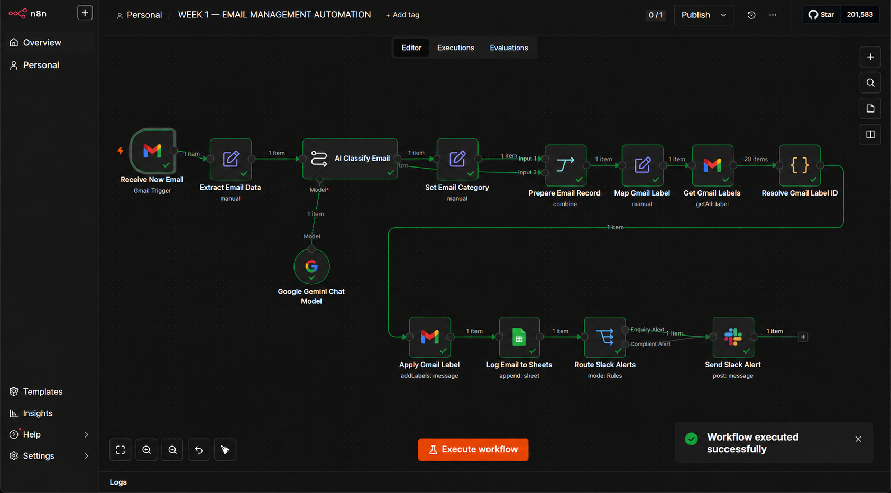
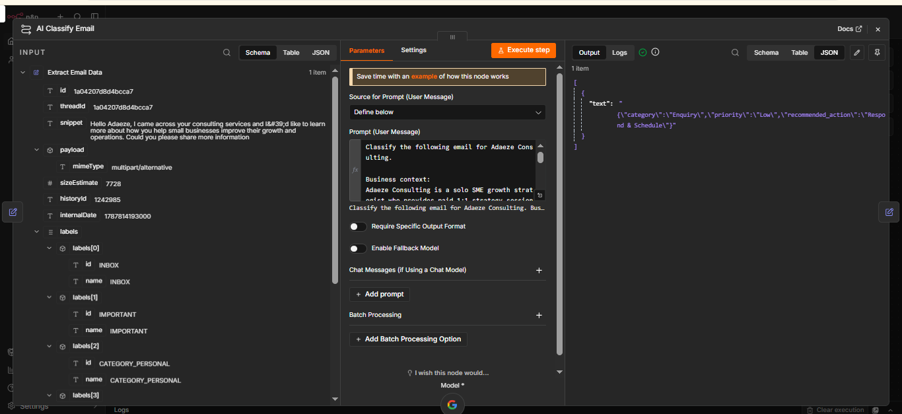
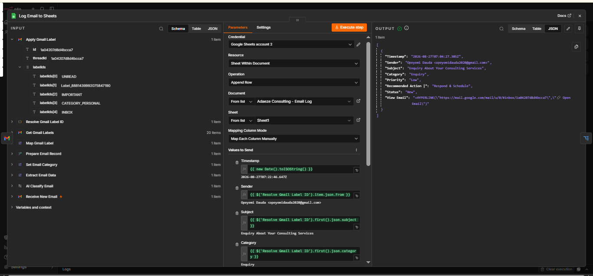

# Week 1 — Email Management Automation

## 📌 Project Overview

An AI-powered email management and triage automation built for **Adaeze Consulting**, a solo SME growth strategist who provides paid 1:1 strategy sessions.

The automation processes incoming emails, uses AI to classify them, determines their priority, recommends the appropriate action, applies Gmail labels, logs the email information in Google Sheets, and sends Slack alerts for emails that require attention.

---

## 🎯 Business Problem

Adaeze Consulting receives different types of emails, including potential client enquiries, complaints, billing-related messages, newsletters, and other communications.

Manually reviewing and organizing every email can be time-consuming and makes it easier for important messages to be overlooked.

This automation was designed to reduce manual email triage and give Adaeze a structured way to manage incoming communications.

---

## ⚙️ How the Automation Works

```text
New Email
    ↓
Gmail Trigger
    ↓
Extract Email Data
    ↓
AI Email Classification
    ↓
Set Category, Priority & Recommended Action
    ↓
Prepare Email Record
    ↓
Map Gmail Label
    ↓
Retrieve Gmail Labels
    ↓
Apply Appropriate Gmail Label
    ↓
Log Email in Google Sheets
    ↓
Route Important Emails
    ↓
Slack Alert
```

---

## 🤖 AI Classification

Google Gemini analyzes each incoming email and classifies it into exactly one of five categories:

| Category            | Description                                                                                                              |
| ------------------- | ------------------------------------------------------------------------------------------------------------------------ |
| **Enquiry**         | Potential or existing client asking about services, pricing, availability, booking, consultation, or working with Adaeze |
| **Complaint**       | Customer dissatisfaction, service problems, refund requests caused by a problem, or formal complaints                    |
| **Invoice/Billing** | Invoices, receipts, payments, charges, or billing administration                                                         |
| **Spam/Newsletter** | Newsletters, promotional emails, unsolicited marketing, cold pitches, sales messages, or subscription emails             |
| **Other**           | Emails that do not clearly fit the other categories                                                                      |

The AI also assigns a priority:

* **High** — requires prompt human attention
* **Low** — does not require immediate attention

---

## 💡 Recommended Actions

The AI recommends one appropriate action based on the email:

* **Respond & Schedule**
* **Respond to Client**
* **Review & Resolve**
* **Process Payment/Billing**
* **Archive/Ignore**
* **Review Manually**

---

## 📊 Google Sheets Email Log

Each processed email is recorded in a Google Sheets tracker containing:

* Timestamp
* Sender
* Subject
* Category
* Priority
* Recommended Action
* Status
* View Email

The **View Email** field provides a direct link back to the original Gmail message, allowing the user to quickly review the email.

---

## 🏷️ Automated Gmail Organization

Emails are automatically assigned Gmail labels according to their AI classification:

```text
Enquiry          → Auto/Enquiry
Complaint        → Auto/Complaint
Invoice/Billing  → Auto/Invoice
Spam/Newsletter  → Auto/Spam
Other            → Auto/Other
```

This keeps the Gmail inbox organized without requiring manual categorization.

---

## 🚨 Slack Alerts

Emails requiring attention can be routed to Slack.

The alert includes information such as:

* Priority
* Category
* Sender
* Subject

This provides a quick notification when an email requires human attention.

---

## 🛡️ Error Handling

A separate error-handling workflow has been connected to the main automation.

```text
Main Workflow Error
        ↓
Error Trigger
        ↓
Slack Alert
        ↓
Adaeze is notified
```

The error handler is designed to provide information about the failed workflow and node so that the issue can be investigated quickly.

---

## 🧰 Tools Used

* **n8n** — workflow automation
* **Gmail** — email trigger and organization
* **Google Gemini** — AI email classification
* **Google Sheets** — email tracking and logging
* **Slack** — notifications and alerts

---

## 🔑 Key Automation Features

* Automated email intake
* AI-powered email classification
* Priority detection
* Recommended action generation
* Automated Gmail labeling
* Centralized email tracking
* Direct Gmail message links
* Slack notifications
* Error-handling workflow

---

## 📈 Outcome

The workflow transforms incoming emails from an unstructured inbox into an organized email management system.

Instead of manually reviewing and categorizing every message, the automation provides:

**Classification → Prioritization → Recommended Action → Organization → Tracking → Notification**

This allows the user to focus human attention on emails that actually require it.

---

## 📁 Project File

The repository includes the sanitized n8n workflow export:

`WEEK 1 — EMAIL MANAGEMENT AUTOMATION - GITHUB SAFE.json`

Sensitive credentials and private account configuration have been removed from the public workflow export.

---

## 👩🏽‍💻 Project Type

**AI Automation | Email Management | Workflow Automation | Business Process Automation**

Built as part of a practical AI Automation portfolio.


## Workflow Screenshot



### AI Classification Node



### Google Sheets Email Logging

The workflow also logs processed emails into Google Sheets for tracking and record-keeping.

The log captures key information such as:

- Timestamp
- Sender
- Email subject
- Classification category
- Status
- Priority
- Gmail message reference/link


